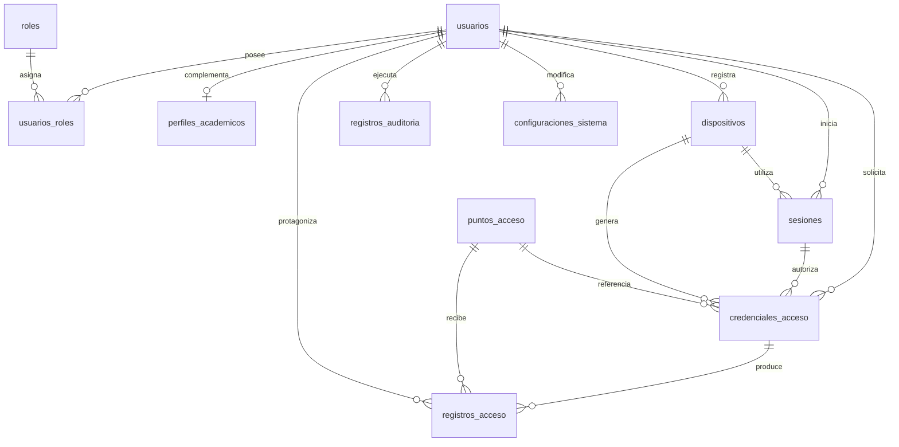

# Modelo de datos del sistema

Este modelo corresponde al Hito 2 del Sistema de Identidad Digital y Control
de Acceso UPT. Se implementa sobre MariaDB y utiliza nombres propios en
español.

## Relaciones principales



## Tablas

- `usuarios`: identidad, estado, autorización y hash de contraseña local.
- `roles` y `usuarios_roles`: autorización de muchos a muchos. Los roles
  iniciales son `ESTUDIANTE`, `DOCENTE`, `TRABAJADOR`, `SEGURIDAD` y
  `ADMINISTRADOR`.
- `perfiles_academicos`: datos académicos opcionales, separados de la cuenta.
- `dispositivos`: registra una huella no reversible del dispositivo.
- `sesiones`: almacena hashes de tokens, vigencia y revocación.
- `puntos_acceso`: define puntos y radios configurables para geocerca.
- `credenciales_acceso`: conserva hashes del token, OTP y nonce; no almacena
  datos personales dentro de la representación QR.
- `registros_acceso`: registra decisiones autorizadas y denegadas, incluyendo
  intentos con tokens desconocidos mediante una huella no reversible.
- `registros_auditoria`: registra operaciones administrativas y sensibles.
- `configuraciones_sistema`: mantiene parámetros del backend fuera de Flutter.
- `migraciones_aplicadas`: controla el orden de evolución del esquema.

## Restricciones relevantes

- Código y correo institucional son únicos.
- Los roles y claves de configuración se guardan en mayúsculas.
- Los estados aceptan únicamente valores conocidos.
- Las relaciones están protegidas mediante claves foráneas.
- Las latitudes, longitudes y radios poseen validaciones de rango.
- Una sesión o credencial debe expirar después de ser emitida.
- Los tokens de sesión, renovación, QR, OTP y nonce se almacenan como hashes
  únicos; nunca en texto plano.
- El uso o revocación exige su fecha correspondiente.

La capa de aplicación comprueba que las sesiones estén activas, vigentes y
pertenezcan a usuarios habilitados. La asignación de roles exige
`ADMINISTRADOR`; la validación futura de ingresos exigirá `SEGURIDAD`.

## Parámetros provisionales

La migración de catálogos incorpora valores de desarrollo para duración del
QR, sesión, intentos de acceso y radio de ubicación. No son reglas oficiales
de la UPT. Las coordenadas enviadas por un cliente tampoco prueban por sí solas
la presencia física de una persona.

## Datos de prueba

Los datos ficticios se cargan de forma idempotente:

```bash
npm run sembrar:pruebas
```

La semilla crea únicamente identidades bajo el dominio reservado
`example.invalid`, roles asociados, un perfil académico ficticio y un punto de
acceso con coordenadas de prueba. El script rechaza su ejecución cuando
`NODE_ENV=production`.
